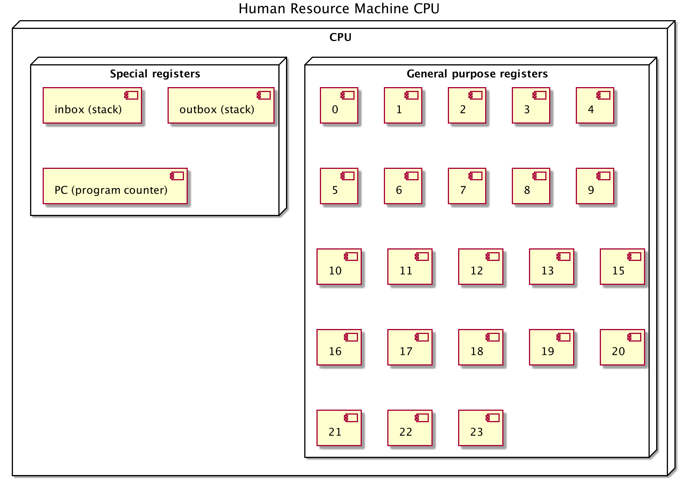
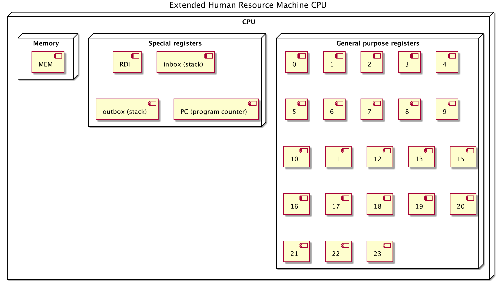

# HRM-assembly
Implementation of the assembly of the game Human Resources Machine. It is not supposed to be compatible with the game (some instructions names are different, the alias instruction is added to mimick the comment on the floor tile feature and make the resulting code more readable). All the [assignments](src/test/asm/nl/suriani/hrmasm/app) are implemented in the tests (an extended set of instructions is added to facilitate testing without the need of instantiating one unit test or main class per .asm file.). I also further extended the original CPU and instructions set to allow some more advanced operations. I implemented the language in plain Java with an ad hoc lexer and parser implementation (nice exercise).

## The CPU
### Original HRM CPU

#### Instruction set
| Instruction   | syntax | explanation |
|-------------  |--------|-------------|
| add           | add [Rn]      | Adds cache value to register value and sets to the cache |
| alias           | alias [Rn] #[name]     | Defines an alias for a given register |
| bump-           | bump- [Rn]    | Subtracts 1 to the value of a register, saves it to the register and to the cache |
| bump+           | bump+ [Rn]   | Adds 1 to the value of a register, saves it to the register and to the cache |
| copyfrom           | copyfrom [Rn]     | Copies value from a register and saves it to the cache |
| copyfrom*           | copyfrom* [Rn]     | Like copyfrom, but indirect access |
| copyto           | copyto [Rn]     | Copies cache value to register |
| copyto*           | copyto* [Rn]     | Like copyto, but indirect access |
| inbox           | inbox     | Pulls a value from the inbox |
| jump           | jump [label]     | Sets the program counter to the instruction after the label |
| jump0           | jump0 [label]     | Sets the program counter to the instruction after the label (if cache value is 0)|
| jumpn           | jumpn [label]     | Sets the program counter to the instruction after the label (if cache value is negative) |
| outbox           | outbox     | pushes a value to the outbox |
| sub           | sub [Rn]      | Subtracts register value from cache value and sets to the cache |

### Extended HRM CPU

#### Additional instructions
| Instruction   | syntax | explanation |
|-------------  |--------|-------------|
| db           | [label]: db "some string..."     | Defines a constant to put in memory with a key corresponding to the label |
| div           | div [Rn]      | Divides register value from cache value and sets to the cache |
| eq            | eq [Rn]       | Checks if cache value is equal to register value and sets 0 if true and -1 if false |
| mod           | mov [Rn], [value] / mod [Rn] | Like div, but saves the rest of the division to the cache |
| mov           | mov [Rn], [value] / mov [RDI], [value] | Copies a value to a register and saves it to the cache |
| mul           | mul [Rn]      | Multiplies cache value to register value and sets to the cache |
| ret           | ret      | Stops program execution without value |
| retv          | retv      | Stops program execution with value |
| syscall       | syscall "some system program..." | Allows to call a system program. If a parameter is used it must be set to RDI. The return value is set to the cache |
